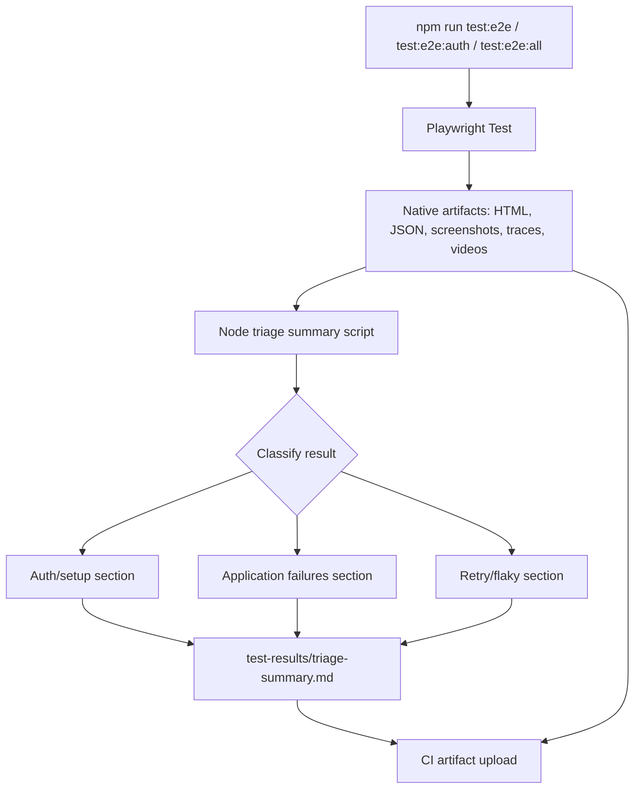

# Phase 4: Regression Operations - Research

**Researched:** 2026-05-11 **Domain:** Playwright regression reporting, CI
artifacts, local command tiers, and maintenance documentation **Confidence:**
HIGH

## User Constraints

### Triage Artifacts

- **D-01:** The planner may choose the smallest useful triage improvement.
  Prefer a lean failure summary if it reduces time-to-failure without replacing
  native Playwright HTML, JSON, screenshots, traces, videos, or `page-errors`.
- **D-02:** Triage output should be available as both a local file and a CI
  artifact.
- **D-03:** The planner may choose the filtering approach, but all generated
  triage output remains bound by the existing no-secrets rule. Do not include
  credential values, cookies, tokens, serialized storage state, or
  secret-bearing terminal output.
- **D-04:** Triage output should summarize auth/setup state separately from app
  test failures so stale, missing, or skipped authenticated state is not
  confused with a VerifyIQ app regression.

### Retry Policy

- **D-05:** Keep the current retry split: CI uses `retries: 2`, while local
  Playwright runs use `retries: 0`.
- **D-06:** Triage output should include a visible flaky/retry section when a
  test passes only after retry.
- **D-07:** Keep trace capture at `on-first-retry`.
- **D-08:** Documentation should use storage-state-first guidance for flaky
  authenticated failures. Operators should classify stale, missing, malformed,
  or unauthenticated storage state before treating failures as app regressions.

### Command Tiers

- **D-09:** Keep the current normal developer hook split: pre-commit runs
  `lint-staged`; pre-push runs `npm run check` and `npm run test:e2e`.
- **D-10:** CI should target full Playwright regression when authenticated
  storage-state secrets are available.
- **D-11:** CI should explicitly skip authenticated/full-regression coverage
  when auth storage-state secrets are absent, preserving fork-safe behavior.
- **D-12:** `npm run test:e2e:all` should be documented as an expected local
  before-push command, but it should not be enforced by the pre-push hook.

### Maintenance Runbook

- **D-13:** The maintenance workflow should live in `README.md`, with existing
  docs linked where needed. Keep `docs/ai-development-workflow.md` focused on AI
  execution roles.
- **D-14:** The runbook should cover the operational workflow: refreshing auth
  state, interpreting triage output, updating tests and fixtures, and choosing
  the right command tier.
- **D-15:** The planner may add automated cleanup only if the visible UI exposes
  safe controls. Hidden cleanup APIs should not be invented for this phase.
- **D-16:** Selector maintenance guidance should prefer stable user-visible
  locators first: roles, labels, and headings. Test ids are acceptable only when
  visible locators are insufficient.

### the agent's Discretion

- The planner may choose the exact triage summary format, file path, and
  filtering implementation as long as it remains secret-safe and does not
  replace native Playwright artifacts.
- The planner may decide whether sandbox cleanup is feasible after inspecting
  the current UI. If safe visible cleanup is unavailable, document accumulation
  and automation naming rather than adding hidden cleanup.
- The planner may choose exact script names and wiring for any new operational
  helper commands, provided the command tier decisions above stay intact.

### Deferred Ideas

None - discussion stayed within Phase 4 scope.

## Project Constraints (from AGENTS.md)

- GSD owns `.planning/` lifecycle artifacts. [VERIFIED: AGENTS.md]
- Read project planning docs before significant work. [VERIFIED: AGENTS.md]
- For Phase 2 onward, Codex plans, reviews, and verifies; Claude Opus 4.7
  implements first through `npm run ai:implement`, with Codex fallback only for
  Claude usage/quota/rate-limit/overload failures. [VERIFIED: AGENTS.md]
- Playwright tests are the executable source of truth for automation behavior.
  Browser helpers are exploration/debugging only. [VERIFIED: AGENTS.md]
- `npm run check` is required before completing non-trivial repo changes.
  [VERIFIED: AGENTS.md]
- `npm run test:e2e` covers public smoke coverage; `npm run test:e2e:auth` is
  used when valid auth state is available; `npm run test:e2e:all` covers full
  Playwright coverage. [VERIFIED: AGENTS.md]
- Real `.env` files and `playwright/.auth/` remain ignored/local. Do not
  hardcode sandbox credentials or print credential, cookie, token, or serialized
  storage-state values. [VERIFIED: AGENTS.md]
- Auth-state precedence is fixed as `VERIFYIQ_STORAGE_STATE_JSON`, then
  `VERIFYIQ_STORAGE_STATE_PATH`, then local `playwright/.auth/user.json`, then
  credential login; `VERIFYIQ_FORCE_LOGIN=1` bypasses only the local file.
  [VERIFIED: AGENTS.md]

## Summary

Phase 4 should be planned as operational hardening around existing Playwright
outputs, not as a reporting replacement. The current config already produces
native HTML reports, CI JSON results at `test-results/results.json`, screenshots
on failure, traces on first retry, retained failure videos, and artifacts under
`test-results/artifacts`. [VERIFIED: codebase grep] Current Playwright docs
support multiple reporters, JSON `outputFile`, `trace: on-first-retry`,
`screenshot: only-on-failure`, `video: retain-on-failure`, and `testInfo.attach`
for reporter-visible attachments. [CITED: Context7 /microsoft/playwright]

The smallest useful improvement is a deterministic Node triage script that reads
Playwright's JSON report after a run and writes a lean Markdown summary, for
example `test-results/triage-summary.md`. The summary should classify setup/auth
failures separately from application failures, list failed tests and retry-pass
tests, and refer operators back to native Playwright artifacts instead of
embedding sensitive or oversized data. [VERIFIED: codebase grep] CI should
upload this summary alongside `playwright-report/` and `test-results/`; it
should also make the absence of authenticated storage-state secrets explicit in
the CI log or a small generated note. [VERIFIED: .github/workflows/e2e.yml]

**Primary recommendation:** Plan two implementation slices: first add the
secret-safe triage summary script and CI artifact wiring, then update README
maintenance guidance and command-tier documentation while preserving existing
hook costs.

## Architectural Responsibility Map

| Capability                    | Primary Tier            | Secondary Tier                | Rationale                                                                                                                                                                                            |
| ----------------------------- | ----------------------- | ----------------------------- | ---------------------------------------------------------------------------------------------------------------------------------------------------------------------------------------------------- |
| Native browser artifacts      | Playwright runtime      | CI artifact upload            | Playwright already owns traces, screenshots, video, HTML, and JSON report generation. [VERIFIED: playwright.config.ts]                                                                               |
| Lean triage summary           | Node CLI script         | Playwright JSON reporter      | A script can consume `test-results/results.json` without changing test semantics or replacing native reports. [CITED: Context7 /microsoft/playwright]                                                |
| Auth/setup classification     | Node CLI script         | Auth setup project            | Setup failures originate in `tests/auth.setup.ts` and `tests/support/auth-state.ts`; summary can classify by project/file/error text without printing secret-bearing data. [VERIFIED: codebase grep] |
| Retry/flaky visibility        | Node CLI script         | Playwright retry metadata     | Playwright result data includes retry attempts; current config keeps CI retries at 2 and local retries at 0. [VERIFIED: playwright.config.ts]                                                        |
| CI retention and availability | GitHub Actions workflow | Playwright output directories | `.github/workflows/e2e.yml` already uploads Playwright report and test results on every run. [VERIFIED: .github/workflows/e2e.yml]                                                                   |
| Maintenance workflow          | README                  | Existing docs links           | Phase context locks README as runbook home and AI workflow docs as role-focused. [VERIFIED: 04-CONTEXT.md]                                                                                           |

## Standard Stack

### Core

| Library            | Version                                       | Purpose                                                                         | Why Standard                                                                                                                         |
| ------------------ | --------------------------------------------- | ------------------------------------------------------------------------------- | ------------------------------------------------------------------------------------------------------------------------------------ |
| `@playwright/test` | 1.59.1, npm modified 2026-05-11T06:24:15.440Z | Test runner, reporters, retries, traces, screenshots, videos, `testInfo.attach` | Already installed and configured; native artifacts remain source of truth. [VERIFIED: npm registry] [VERIFIED: playwright.config.ts] |
| Node.js            | >=24                                          | Triage script runtime and repo scripts                                          | Required by `package.json`; avoids new runtime dependencies. [VERIFIED: package.json]                                                |
| TypeScript         | 6.0.3                                         | Existing repo language and typecheck target                                     | Already part of `npm run check`; any helper source should remain typechecked. [VERIFIED: package.json]                               |
| GitHub Actions     | Workflow file in `.github/workflows/e2e.yml`  | CI checks and artifact upload                                                   | Existing CI control plane for static, public, and authenticated runs. [VERIFIED: .github/workflows/e2e.yml]                          |
| Lefthook           | 2.1.6                                         | Local pre-commit/pre-push hooks                                                 | Existing hook runner; Phase 4 must preserve cheap hook split. [VERIFIED: package.json] [VERIFIED: lefthook.yml]                      |

### Supporting

| Library            | Version            | Purpose                                     | When to Use                                                                                                      |
| ------------------ | ------------------ | ------------------------------------------- | ---------------------------------------------------------------------------------------------------------------- |
| Node `fs/promises` | Node >=24 built-in | Read JSON report and write Markdown summary | Use for triage output generation; no dependency needed. [VERIFIED: package.json]                                 |
| Node `node:test`   | Node >=24 built-in | Unit-test triage parser/formatter           | Use if adding parser tests without introducing a unit-test dependency. [VERIFIED: scripts/ai-implement.test.mjs] |

### Alternatives Considered

| Instead of                      | Could Use                         | Tradeoff                                                                                                                   |
| ------------------------------- | --------------------------------- | -------------------------------------------------------------------------------------------------------------------------- |
| Node script reading JSON report | Custom Playwright reporter        | Reporter gives richer lifecycle hooks, but a post-run script is smaller, easier to test, and uses existing `results.json`. |
| Lean Markdown summary           | Rich per-failure bundle generator | Rich bundles risk duplicating native Playwright reports and increasing secret/artifact surface.                            |
| README runbook                  | New dedicated docs page           | Phase context chose README so maintenance guidance stays in the human entrypoint.                                          |

**Installation:** No new packages recommended.

## Architecture Patterns

### System Architecture Diagram



### Recommended Project Structure

```text
scripts/
  summarize-playwright-results.mjs  # reads test-results/results.json and writes triage Markdown
  summarize-playwright-results.test.mjs  # parser/formatter tests, if added
test-results/
  results.json                      # existing CI JSON reporter output
  triage-summary.md                 # generated local/CI summary
.github/workflows/e2e.yml           # CI execution and artifact upload wiring
README.md                           # maintenance runbook and command-tier guidance
```

### Pattern 1: Post-Run JSON Consumer

**What:** Keep Playwright configuration responsible for producing JSON, then run
a Node script after Playwright commands in CI or through a new npm helper.
[VERIFIED: playwright.config.ts] [CITED: Context7 /microsoft/playwright]

**When to use:** Use for lean summaries that can be produced from completed run
data and do not need live test lifecycle hooks.

**Example:**

```typescript
// Source: Playwright docs support JSON reporter outputFile.
reporter: [["json", { outputFile: "test-results/results.json" }]];
```

### Pattern 2: Text Attachments for Focused Diagnostics

**What:** Use `testInfo.attach` for small, targeted text/JSON diagnostic
payloads that help debug failed tests. Existing code attaches `page-errors` and
Add Application form inventory. [VERIFIED: tests/support/page-errors.ts]
[VERIFIED: tests/support/application-workflow.ts] [CITED: Context7
/microsoft/playwright]

**When to use:** Add small allowlisted attachments only when they are useful and
secret-safe.

### Pattern 3: Explicit Auth-State Classification

**What:** Classify setup-project/auth-state failures separately from application
test failures by matching setup project, `auth.setup.ts`, `auth-state.ts`, or
the known storage-state recovery guidance strings. [VERIFIED:
tests/auth.setup.ts] [VERIFIED: tests/support/auth-state.ts]

**When to use:** Use in triage summary so operators refresh state before
treating an authenticated failure as a product regression.

### Anti-Patterns to Avoid

- **Replacing Playwright HTML/trace/video:** Native artifacts already contain
  rich debugging data. The summary should point to them, not duplicate them.
- **Printing raw error context blindly:** Error text may include unexpected
  secret-bearing values. Prefer allowlisted fields such as project, file, title,
  status, retry count, and known recovery guidance.
- **Adding auth/full regression to pre-push hook:** Phase context keeps pre-push
  cheap with `npm run check` and `npm run test:e2e`.
- **Inventing cleanup APIs:** Phase context permits cleanup automation only
  through safe visible UI controls.
- **Treating retry pass as invisible success:** Phase context requires visible
  flaky/retry reporting when a test passes only after retry.

## Don't Hand-Roll

| Problem                                  | Don't Build                                   | Use Instead                                                                 | Why                                                                                                                                      |
| ---------------------------------------- | --------------------------------------------- | --------------------------------------------------------------------------- | ---------------------------------------------------------------------------------------------------------------------------------------- |
| Browser execution and artifacts          | A custom runner or screenshot/trace system    | Playwright Test reporters and `use` artifact options                        | Existing runner already provides reports, traces, screenshots, videos, retries, and attachments. [CITED: Context7 /microsoft/playwright] |
| Report persistence in CI                 | Custom artifact uploader                      | `actions/upload-artifact` steps already used in `.github/workflows/e2e.yml` | Existing workflow uploads `playwright-report/` and `test-results/` on `always()`. [VERIFIED: .github/workflows/e2e.yml]                  |
| Secret filtering by exhaustive blacklist | Broad log scraping and regex-only dumping     | Strict allowlist of fields from JSON report plus short redaction fallback   | Prevents accidental credential, cookie, token, or storage-state leakage.                                                                 |
| Sandbox data cleanup                     | Hidden API calls or guessed backend endpoints | Visible UI cleanup only, or documentation of accumulation                   | Phase context explicitly forbids invented hidden cleanup. [VERIFIED: 04-CONTEXT.md]                                                      |

**Key insight:** The operational gap is not missing rich artifacts; it is
missing a fast, secret-safe first page that tells an operator where to look.

## Common Pitfalls

### Pitfall 1: JSON Report Not Generated Locally

**What goes wrong:** A local triage command expects `test-results/results.json`,
but local `playwright.config.ts` currently enables JSON reporter only in CI.
[VERIFIED: playwright.config.ts]

**Why it happens:** CI and local reporters differ.

**How to avoid:** Either add a dedicated npm script that invokes Playwright with
a JSON reporter for triage, or make the summary script gracefully explain that
`test-results/results.json` is absent and how to regenerate it.

**Warning signs:** `ENOENT test-results/results.json` or an empty triage
summary.

### Pitfall 2: Auth Setup Failure Misclassified as App Regression

**What goes wrong:** Expired or malformed storage state fails before the real
authenticated tests run, but the operator interprets it as a VerifyIQ product
regression.

**Why it happens:** Auth state is validated in the setup project before
authenticated tests; failures name recovery variables and commands. [VERIFIED:
tests/auth.setup.ts] [VERIFIED: tests/support/auth-state.ts]

**How to avoid:** Give setup/auth failures a separate summary section and repeat
storage-state-first recovery guidance in README.

**Warning signs:** Failure in `setup` project, `auth.setup.ts`, or message
containing `Stored VerifyIQ auth state from`.

### Pitfall 3: Retry Pass Hidden in Green CI

**What goes wrong:** A flaky test passes after retry and CI is green, but
operators miss the instability.

**Why it happens:** CI retries are intentionally enabled at 2 while local retry
count is 0. [VERIFIED: playwright.config.ts]

**How to avoid:** Summarize result entries with retry attempts greater than 0 in
a visible `Retry/Flaky` section.

**Warning signs:** Green CI with retry attempts in JSON results or trace files
created by `on-first-retry`.

### Pitfall 4: Hook Cost Creep

**What goes wrong:** Pre-push becomes slow or auth-dependent, so developers skip
hooks or pushes fail in environments without storage state.

**Why it happens:** Authenticated browser tests depend on valid storage state
and can be blocked by reCAPTCHA/manual refresh. [VERIFIED: README.md]

**How to avoid:** Keep `lefthook.yml` unchanged for normal path and document
`npm run test:e2e:all` as a before-push expectation, not a hook.

## Code Examples

### Existing Playwright Reporter Shape

```typescript
// Source: playwright.config.ts and Playwright docs
reporter: process.env.CI
  ? [
      ["github"],
      ["list"],
      ["html", { open: "never" }],
      ["json", { outputFile: "test-results/results.json" }]
    ]
  : [["list"], ["html", { open: "never" }]];
```

### Existing Artifact Capture Policy

```typescript
// Source: playwright.config.ts and Playwright docs
use: {
  screenshot: "only-on-failure",
  trace: "on-first-retry",
  video: "retain-on-failure"
}
```

### Existing Text Attachment Pattern

```typescript
// Source: tests/support/page-errors.ts
await testInfo.attach("page-errors", {
  body: errors.join("\n"),
  contentType: "text/plain"
});
```

## State of the Art

| Old Approach                | Current Approach                                        | When Changed                               | Impact                                                                  |
| --------------------------- | ------------------------------------------------------- | ------------------------------------------ | ----------------------------------------------------------------------- |
| Ad hoc terminal log reading | Native Playwright HTML/JSON plus generated lean summary | Phase 4 plan target                        | Faster triage while preserving source-of-truth artifacts.               |
| Generic retry advice        | Storage-state-first auth failure guidance               | Phase 2/4 decisions                        | Prevents expired auth state from being mislabeled as an app regression. |
| Expensive hooks             | Cheap hooks plus documented full-regression expectation | Current `lefthook.yml` and Phase 4 context | Keeps everyday developer path fast.                                     |

**Deprecated/outdated:**

- Adding hosted browser/agent runtime dependencies for v1 regression operations
  remains out of scope. [VERIFIED: .planning/PROJECT.md]

## Assumptions Log

| #   | Claim                                                                                                                               | Section                        | Risk if Wrong                                                                                |
| --- | ----------------------------------------------------------------------------------------------------------------------------------- | ------------------------------ | -------------------------------------------------------------------------------------------- |
| A1  | Playwright JSON result fields will be sufficient to identify failed, skipped/setup, and retry-pass tests without a custom reporter. | Summary, Architecture Patterns | If wrong, implementation may need a custom Playwright reporter or fixture-level annotations. |

## Open Questions

1. **Should the triage summary be generated automatically after every local
   run?**
   - What we know: CI can run a post-test step; local `test:e2e` currently has
     no JSON reporter. [VERIFIED: package.json] [VERIFIED: playwright.config.ts]
   - What's unclear: Whether local always-on JSON output is worth changing.
   - Recommendation: Plan a dedicated script/command and make CI automatic; keep
     local test commands unchanged unless implementation proves a low-cost path.

2. **Is visible UI cleanup currently safe and stable?**
   - What we know: Phase 3 records use `AUTOMATION` names and cleanup is
     best-effort visible UI only. [VERIFIED: README.md]
   - What's unclear: Whether the current sandbox UI exposes reliable delete or
     archive controls.
   - Recommendation: Do not plan hidden cleanup. If implementation inspection
     finds safe visible controls, add a narrowly scoped cleanup helper;
     otherwise document data accumulation.

## Environment Availability

| Dependency                     | Required By                     | Available   | Version                                    | Fallback                                                               |
| ------------------------------ | ------------------------------- | ----------- | ------------------------------------------ | ---------------------------------------------------------------------- |
| Node.js                        | npm scripts and triage script   | Yes         | >=24 in `package.json`                     | None needed                                                            |
| Playwright Test                | Regression runs and JSON report | Yes         | 1.59.1                                     | None needed                                                            |
| Valid auth storage state       | Authenticated/full regression   | Conditional | Provided by env/file/local recorder        | Skip auth in CI when secret absent; refresh with `npm run auth:record` |
| GitHub Actions artifact upload | CI artifact persistence         | Yes         | Workflow uses `actions/upload-artifact@v7` | Local files under `test-results/`                                      |

**Missing dependencies with no fallback:** None for planning.

**Missing dependencies with fallback:** Valid auth state can be absent; CI
should skip authenticated/full coverage explicitly when storage-state secrets
are absent.

## Validation Architecture

### Test Framework

| Property           | Value                                                                                      |
| ------------------ | ------------------------------------------------------------------------------------------ |
| Framework          | Playwright Test 1.59.1 plus Node.js built-in `node:test` where helper unit tests are added |
| Config file        | `playwright.config.ts`                                                                     |
| Quick run command  | `npm run check`                                                                            |
| Full suite command | `npm run test:e2e:all`                                                                     |

### Phase Requirements -> Test Map

| Req ID  | Behavior                                                                                                                                                  | Test Type                                        | Automated Command    | File Exists?                                                     |
| ------- | --------------------------------------------------------------------------------------------------------------------------------------------------------- | ------------------------------------------------ | -------------------- | ---------------------------------------------------------------- |
| QUAL-04 | GitHub Actions runs static checks, public smoke, and authenticated/full coverage when storage-state secrets exist; explicitly skips auth/full when absent | CI/workflow inspection plus local check          | `npm run check`      | Existing `.github/workflows/e2e.yml`                             |
| QUAL-05 | Playwright reports, test results, and triage summary are uploaded from CI                                                                                 | CI/workflow inspection plus generated file check | `npm run check`      | Existing `.github/workflows/e2e.yml`; triage summary file to add |
| DOCS-03 | README and planning docs document maintenance and command-tier behavior                                                                                   | docs check                                       | `npm run docs:check` | Existing `scripts/check-docs.mjs`                                |

### Sampling Rate

- **Per task commit:** `npm run check`
- **Per wave merge:** `npm run test:e2e`
- **Phase gate:** `npm run check` and, when valid auth state is available,
  `npm run test:e2e:all`

### Wave 0 Gaps

- [ ] Triage parser/formatter tests if the implementation adds non-trivial JSON
      parsing logic.
- [ ] Generated `test-results/triage-summary.md` or equivalent artifact path.
- [ ] CI step that uploads generated triage output when present.

## Security Domain

### Applicable ASVS Categories

| ASVS Category         | Applies | Standard Control                                                                                              |
| --------------------- | ------- | ------------------------------------------------------------------------------------------------------------- |
| V2 Authentication     | Yes     | Preserve auth-state precedence and recovery guidance; never print credentials.                                |
| V3 Session Management | Yes     | Do not expose cookies, tokens, or serialized storage state in triage, logs, docs, or commits.                 |
| V4 Access Control     | No      | Phase changes automation operations, not app access-control logic.                                            |
| V5 Input Validation   | Yes     | Treat Playwright JSON as untrusted input; validate shape before formatting and default missing fields safely. |
| V6 Cryptography       | No      | No cryptographic implementation in scope.                                                                     |
| V9 Communications     | Yes     | CI should consume secrets only through GitHub Actions secret/env mechanisms and avoid echoing values.         |
| V14 Configuration     | Yes     | Preserve local/CI command split and secret-safe artifact settings.                                            |

### Known Threat Patterns for Playwright Regression Operations

| Pattern                                           | STRIDE                 | Standard Mitigation                                                                                                                           |
| ------------------------------------------------- | ---------------------- | --------------------------------------------------------------------------------------------------------------------------------------------- |
| Credential or token leakage through triage output | Information Disclosure | Use allowlisted JSON fields; redact obvious secret-like substrings; never include storage-state JSON, env dumps, cookies, or request headers. |
| Misleading green build after retry                | Repudiation            | Include retry-pass/flaky section in triage summary.                                                                                           |
| Fork CI failure due missing auth secret           | Denial of Service      | Keep explicit skip behavior when `VERIFYIQ_STORAGE_STATE_JSON` is absent.                                                                     |
| Hidden cleanup deletes wrong sandbox data         | Tampering              | Use visible UI cleanup only when safe controls exist; otherwise document accumulation.                                                        |

## Sources

### Primary (HIGH confidence)

- `playwright.config.ts` - reporters, retries, artifacts, projects.
- `package.json` - npm command tiers, dependency versions, Node engine.
- `.github/workflows/e2e.yml` - CI steps and artifact uploads.
- `lefthook.yml` - hook cost split.
- `tests/support/page-errors.ts` - existing text attachment pattern.
- `tests/auth.setup.ts` and `tests/support/auth-state.ts` - auth-state
  precedence, validation, and recovery messages.
- `README.md` - auth guidance, command list, CI behavior, sandbox data notes.
- Context7 `/microsoft/playwright` - current Playwright reporter, artifact, and
  attachment docs.
- npm registry for `@playwright/test` - version `1.59.1`, modified
  `2026-05-11T06:24:15.440Z`.

### Secondary (MEDIUM confidence)

- Existing generated local artifacts: `playwright-report/index.html` and
  `test-results/artifacts/.last-run.json`.

### Tertiary (LOW confidence)

- None.

## Metadata

**Confidence breakdown:**

- Standard stack: HIGH - verified through `package.json`, npm registry, and
  Playwright docs.
- Architecture: HIGH - bounded to existing Playwright outputs and repo scripts.
- Pitfalls: HIGH - derived from current config split and documented auth-state
  behavior.

**Research date:** 2026-05-11 **Valid until:** 2026-06-10 for repo-local
operational patterns; re-check Playwright docs before changing reporter APIs.
